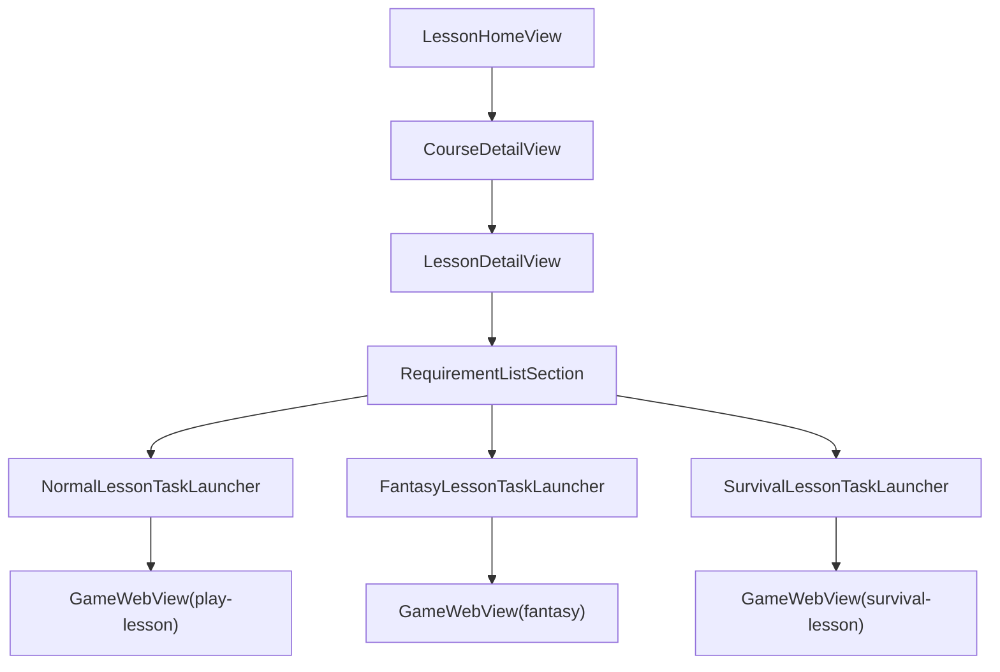

# iOSフルネイティブ化調査メモ

## 今回の結論

- フルネイティブ化は不可能ではないが、現時点では `SwiftUI` 画面置換より `譜面表示` と `演奏エンジン` の移植コストが支配的。
- 先にネイティブ化すべきなのは `認証`、`レッスン一覧`、`コース詳細`、`レッスン詳細`、`課題起動` まで。
- `通常課題 / ファンタジー / サバイバル / レジェンド` の演奏画面を完全ネイティブ化する前に、`譜面だけWebView` を含むハイブリッド PoC を必ず挟むべき。

## 先に直したもの

- `ios/Jazzify/Services/SupabaseService.swift`
  - `SupabaseClient` 初期化時に `emitLocalSessionAsInitialSession: true` を設定。
  - これで `supabase-swift` の initial session 警告を抑制できる。

## ログの扱い

- `Initial session emitted ...`
  - 修正対象。今回の `SupabaseClient` 設定で対応。
- `nw_connection_copy_connected_local_endpoint_block_invoke`
  - iOS Simulator / `WKWebView` 周辺で出やすいログノイズ寄り。通信失敗がなければ優先度は低い。
- `FontParser could not open filePath ... AppleColorEmoji.ttc`
  - Simulator 環境依存の警告の可能性が高い。再現する実害がなければ後回しでよい。

## 現在の依存関係

### レッスン導線

- iOS 側一覧は `ios/Jazzify/Main/LessonListView.swift` にあり、現状はレッスン押下で `GameWebView` に `#lesson-detail` を渡している。
- Web 側のレッスン詳細は `src/components/lesson/LessonDetailPage.tsx`。
- ただし Web 側は `LessonPage` / `CoursePage` / `LessonDetailPage` のハッシュ遷移前提で作られており、単体切り出しに弱い。

### 譜面表示

- 通常課題: `src/components/game/SheetMusicDisplay.tsx`
- ファンタジー: `src/components/fantasy/FantasySheetMusicDisplay.tsx`
- どちらも `OpenSheetMusicDisplay` に強依存。
- 特にファンタジーは次をまとめて持っている。
  - `MusicXML` の移調
  - 12キー分の事前レンダリング
  - 画像キャッシュ
  - 時間マッピング生成
  - 再生位置同期スクロール
  - 結合セクションの先読み表示

### 音楽理論

- `src/utils/musicXmlTransposer.ts`
  - `Tonal` を使ったキー移調、interval、移調楽器対応。
- `src/utils/musicXmlToProgression.ts`
  - `MusicXML` から progression データ生成。
- `src/utils/musicXmlMapper.ts`
  - コード進行抽出、時間同期、コード移調。

### 演奏エンジン

- 通常課題は `src/components/game/GameScreen.tsx` 周辺。
- ファンタジーは `src/components/fantasy/FantasyGameScreen.tsx` と `FantasyGameEngine.tsx`。
- サバイバルは `src/components/survival/SurvivalGameScreen.tsx`。
- いずれも `React` の状態管理、`PIXI`、`Tone/WebAudio`、`DOM`、`window`、`requestAnimationFrame` に深く依存。

## フルネイティブ化の実現性

### 1. SwiftUI 画面

実現性は高い。

- 一覧、詳細、モーダル、ナビゲーションは `SwiftUI` で十分置換可能。
- 現在の iOS 既存実装を拡張すればよい。

### 2. データ取得と進捗同期

実現性は高い。

- `SupabaseService.swift` が既に存在する。
- 追加すべき主な取得対象は以下。
  - `course_prerequisites` を含むコース詳細
  - `lesson_songs` を含むレッスン詳細
  - `lesson_videos`
  - `lesson_attachments`
  - `user_lesson_requirements_progress`

### 3. 音楽理論処理

実現性は中。

- `Tonal` 自体は Swift でそのまま使えない。
- ただし必要機能は限定的なので、次のどちらかで置換可能。
  - Swift の音楽理論ライブラリを採用
  - 必要最小限の理論処理だけ自前移植
- 移植候補機能:
  - ルート音移調
  - interval 表示
  - 移調楽器のキー変換
  - chord symbol の表記補正

### 4. 譜面表示

実現性は低〜中。

- ここが最大の難所。
- 問題は `MusicXML を表示する` だけではなく、`演奏タイミングと同期した譜面UI` を再現する必要がある点。
- 現状の Web 実装は OSMD の内部レイアウト結果をかなり利用している。
- 同等品質のネイティブ代替は、すぐには見つかりにくい。

### 5. 演奏エンジン全体

実現性は低。

- 判定、描画、譜面、入力、音声、設定、進捗更新まで横断する。
- 特にファンタジー/サバイバルは単純なリズムゲームではなく、ゲームループとUIが結合している。

## レッスン導線の推奨ネイティブ設計

### 目標

- `レッスン一覧 -> コース詳細 -> レッスン詳細 -> 課題一覧 -> 課題起動` までは完全に `SwiftUI`。
- 起動先の演奏画面だけ、当面は `GameWebView` に橋渡し。

### 画面構成案

### iOS 側に追加したいモデル

- `LessonDetail`
  - `assignmentDescription`
  - `navLinks`
  - `lessonSongs`
  - `videos`
  - `attachments`
- `LessonSong`
  - `songId`
  - `fantasyStageId`
  - `isFantasy`
  - `isSurvival`
  - `survivalStageNumber`
  - `clearConditions`
  - `title`
- `LessonRequirementProgress`
  - `lessonSongId`
  - `songId`
  - `clearCount`
  - `clearDates`
  - `bestRank`
  - `isCompleted`
  - `dailyProgress`
- `CoursePrerequisite`

### iOS 側に追加したい API

- `fetchCoursesWithPrerequisites()`
- `fetchCourse(courseId:)`
- `fetchLessonDetail(lessonId:)`
- `fetchLessonVideos(lessonId:)`
- `fetchLessonAttachments(lessonId:)`
- `fetchLessonRequirementProgress(lessonId:userId:)`
- `updateLessonProgress(...)`

## 譜面表示 PoC 候補

### 候補比較

| 候補 | 役割 | この案件との相性 | 評価 |
| --- | --- | --- | --- |
| 既存 `OSMD` + 専用 `WKWebView` | 現行資産の再利用 | 最も高い。既存の `MusicXML`、移調、同期ロジックを流用しやすい | 本命 |
| `Verovio` | ネイティブ寄りの MusicXML/MEI レンダリング | Swift binding があり PoC 価値は高いが、現行の時間マップや 12 キー事前描画をそのまま置換できるかは未確認 | 対抗 |
| `SwiftMXL` | MusicXML パース | 描画エンジンではないため単独では不足 | 補助候補 |
| `VexFoundation` | Swift ネイティブ譜面描画 | 将来性はあるが新しく、MusicXML 互換と現行機能の再現性が未知数 | 研究候補 |
| 事前画像配信 | 表示専用 | 移調や可変表示に弱い | 限定用途 |

### 案A: 譜面だけ専用 WebView

最有力。

- 既存 `OSMD` 実装を最大限流用できる。
- 演奏エンジンだけ先に Swift 化する場合でも、譜面は分離しやすい。
- デメリット:
  - Web <-> Native の同期設計が必要
  - 複数描画層の管理が複雑

### 案B: ネイティブ MusicXML ライブラリ導入

PoC は価値ありだが、本命とは言いにくい。

- パースだけできても、現行の `OSMD` 相当レベルの見た目と同期まで到達できるとは限らない。
- ファンタジー譜面の 12 キー事前レンダリング再現が重い。
- `Verovio` は PoC 候補として最も現実的。
- `SwiftMXL` は `MusicXML` の型安全な読み込みには使えても、描画の本命にはなりにくい。
- `VexFoundation` は面白いが、現時点では採用判断より PoC 止まりが妥当。

### 案C: 楽譜を事前画像化して配信

限定用途なら有効。

- 表示だけならかなり安定する。
- ただし次を失いやすい。
  - 動的移調
  - 移調楽器対応
  - 可変テンポや結合セクション
  - 画面サイズに応じた柔軟な再レイアウト

### 案D: 完全ネイティブ譜面エンジン自作

現時点では非推奨。

- 工数に対してリスクが大きすぎる。
- 少なくとも最初の移行フェーズでは避けるべき。

## 推奨 PoC 順序

1. `譜面だけWebView` 方式で通常課題を Swift ネイティブ画面に埋め込む。
2. `MusicXML -> 時間マップ` のみ Swift 側で扱えるか検証する。
3. ファンタジーの `12キー事前レンダリング` をネイティブで再現せずに済む構成を探る。
4. それでも UX が足りなければ、ネイティブ譜面ライブラリの小規模 PoC を作る。

## ゲームエンジンの境界案

### モジュール単位の判断

| 領域 | 現状依存 | 先にSwift化するか | 理由 |
| --- | --- | --- | --- |
| 画面状態と遷移 | `React` / hash routing | する | `SwiftUI Navigation` で置換しやすい |
| Supabase データ取得 | `supabase-js` | する | 既に iOS 側基盤あり |
| 課題起動パラメータ生成 | URL hash / query | する | Native から `GameWebView` へ橋渡し可能 |
| 通常課題の判定 | Web game state | しない | 譜面、ノーツ、結果反映が密結合 |
| ファンタジー戦闘ロジック | `FantasyGameEngine.tsx` | しない | 判定、戦闘、描画、譜面が一体 |
| サバイバル戦闘ロジック | `SurvivalGameScreen.tsx` | しない | スキル、当たり判定、描画依存が大きい |
| 譜面同期スクロール | `OSMD` 内部座標 + rAF | しない | 最難所。PoC後に再判断 |
| MIDI / 音声入力統合 | Web + Native bridge | 部分的にする | 入力取得は Native 寄り、判定投入は段階移行が必要 |

### 先にネイティブ化してよい範囲

- 画面遷移
- データ取得
- コース/レッスン/課題一覧
- 課題説明、動画、添付ファイル
- 課題の進捗表示
- 起動パラメータ生成

### 当面 Web 維持を推奨する範囲

- 通常課題の演奏判定
- ファンタジー戦闘
- サバイバル戦闘
- 譜面同期スクロール
- PIXI ベースの描画
- WebAudio / MIDI / 音声入力の複合制御

## 最終判断

- `レッスン体験をネイティブに見せる` のは現実的。
- `譜面と演奏まで含めて完全ネイティブ` は、今すぐ本線に置くにはリスクが高い。
- 現実的な到達点は次。
  - 画面とデータ導線は `SwiftUI`
  - 譜面は当面 `専用WebView` または既存 `GameWebView`
  - 演奏エンジンは最後に移植判断
- つまり「iOS フルネイティブ化は将来的には可能」だが、「今すぐ全面移植」は非推奨で、「レッスン導線ネイティブ + 譜面/演奏は段階移行」が妥当。

## 推奨次アクション

- `LessonDetailView` 用の Swift モデルと Supabase API を追加する。
- `#lesson-detail` 依存をやめて、iOS で課題一覧をネイティブ表示する。
- 通常課題 1 本だけ、`SwiftUI + 譜面専用WebView + Web演奏` の PoC を作る。
